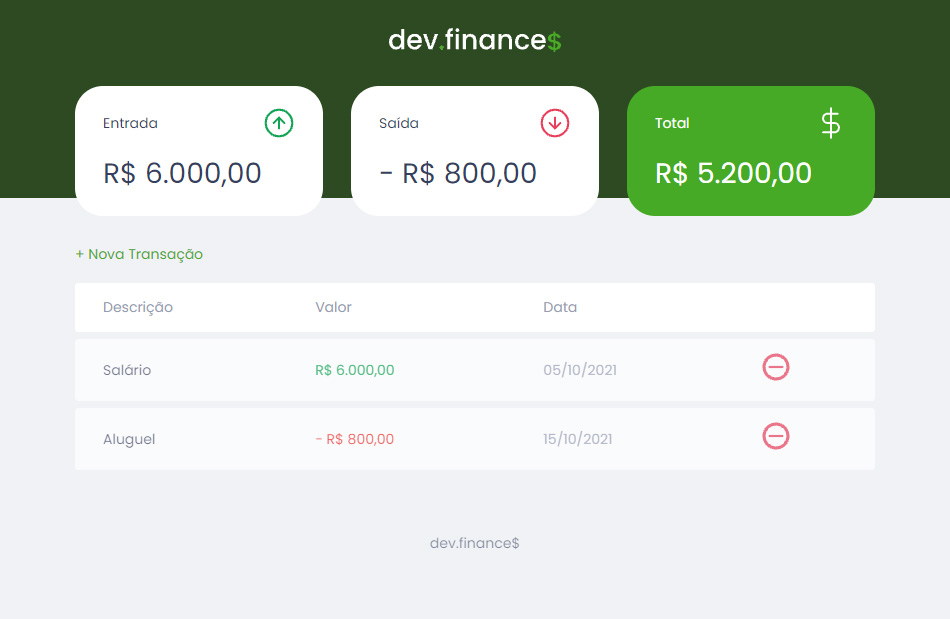

# dev-finances
**Exercício da Maratona Dicover - Edição 01 - Rocketseat**

## :earth_americas: Demo Online: 
Acesse: [dev-finance](https://rafae1menezes.github.io/dev-finances-rocketseat/#)

## :memo: Objetivo: 
Construir um mini sistema financeiro com fluxo de caixa.

## :desktop_computer: Tecnologias Usadas:
* HTML5
* CSS3
* JavaScript

## :hammer: Como Utilizar:

Abrir aquivo `index.html` no seu navegador

## :camera: Screenshot:
 *Dashboard*
